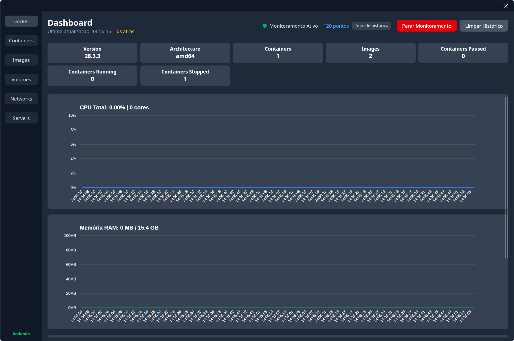
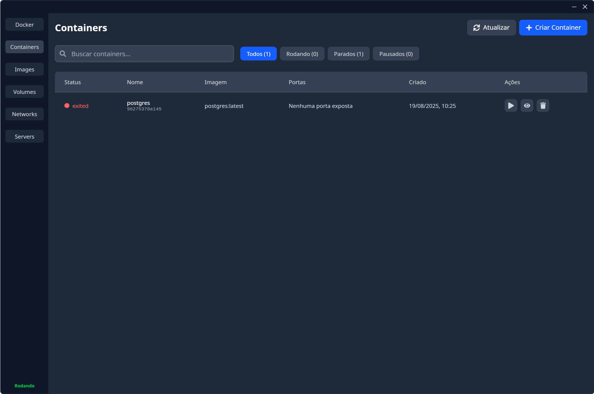
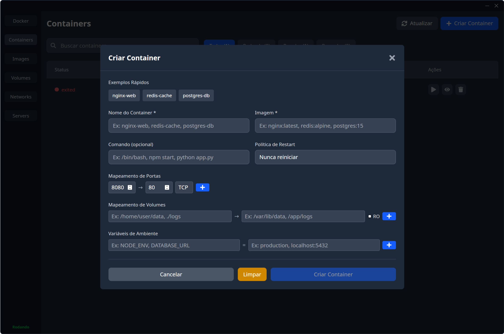
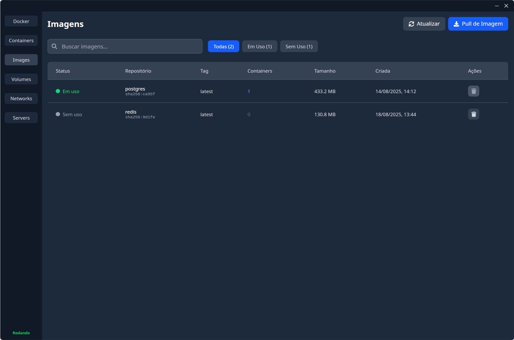
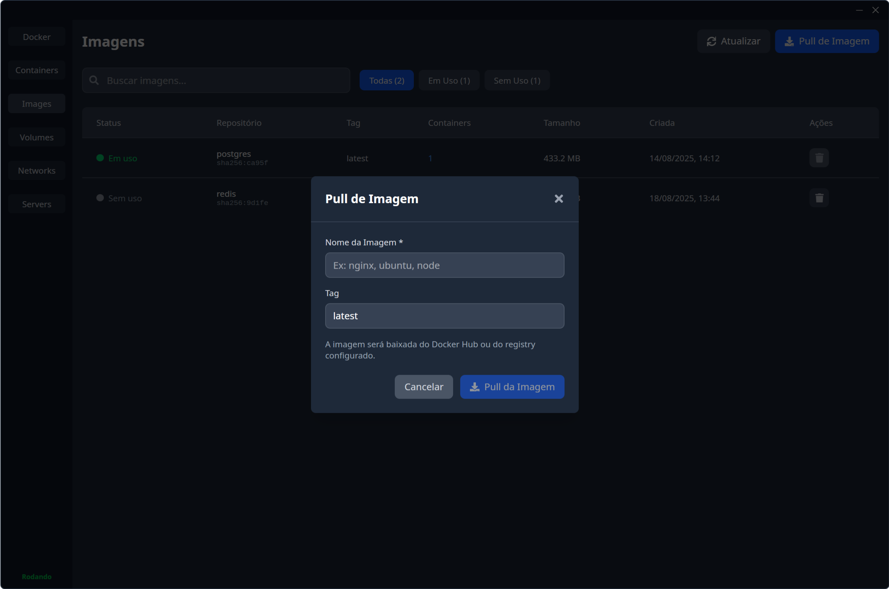
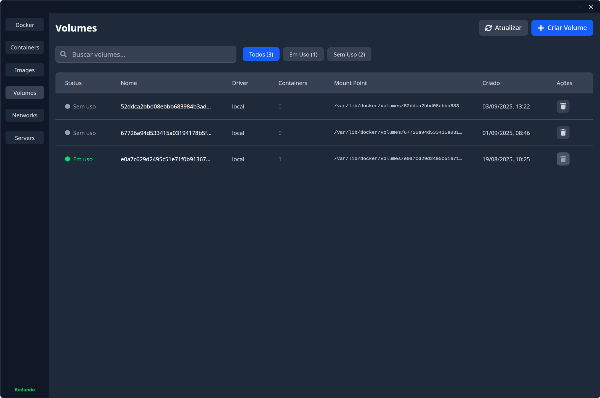
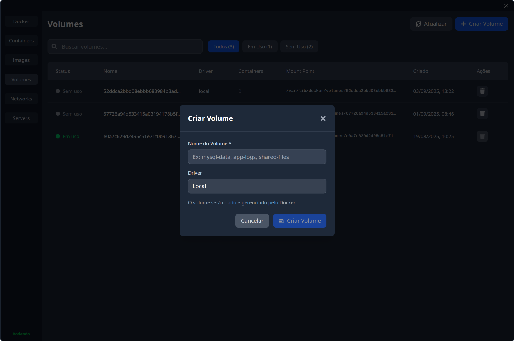
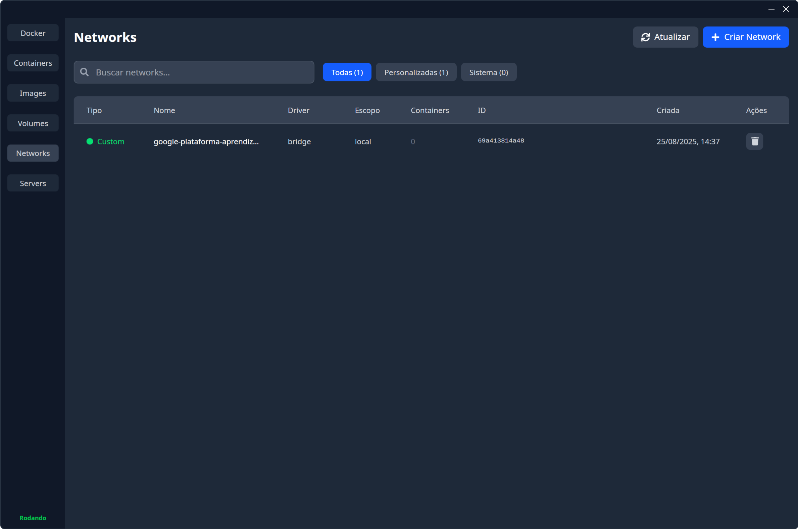
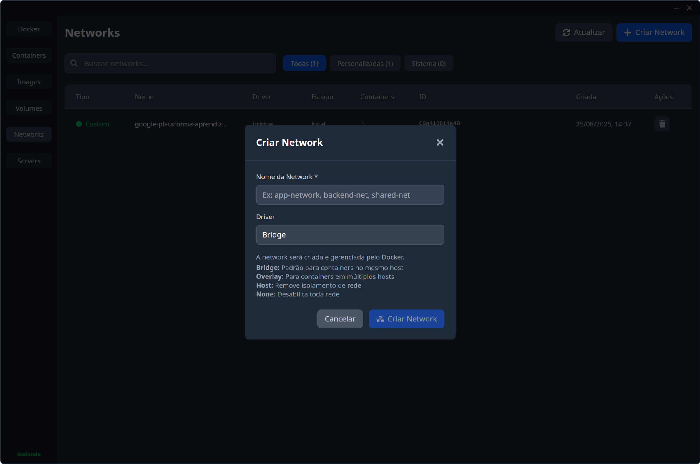

# Docker UI Tauri

A modern desktop Docker management application built with Tauri, React, and TypeScript. Provides a comprehensive interface for managing Docker containers, images, networks, and volumes with real-time monitoring capabilities.

## 📸 Screenshots

### Dashboard - Real-time Monitoring

*Real-time system monitoring with CPU, memory, and network charts*

### Container Management

*Complete container lifecycle management with filtering and search*

### Container Creation Modal

*Advanced container creation with port mapping, volumes, and environment variables*

### Image Management

*Docker image management with pull capabilities and usage tracking*

### Image Pull Modal

*Easy image pulling from Docker registries*

### Volume Management

*Docker volume management with creation and deletion controls*

### Volume Creation Modal

*Simple volume creation interface*

### Network Management

*Network management with system and custom network distinction*

### Network Creation Modal

*Advanced network creation with multiple driver options*

## 🌟 Features

### 📊 **Real-time Dashboard**
- **System Overview**: Docker version, container counts, and architecture info
- **Live CPU Monitoring**: Real-time CPU usage with dynamic scaling based on available cores
- **Memory Usage Tracking**: RAM consumption with intelligent MB/GB unit conversion
- **Network Traffic Monitoring**: Dual-line charts showing RX/TX with auto-scaling units
- **Block I/O Statistics**: Read/write operations monitoring
- **Historical Data**: 60-second rolling window with automatic chart scaling

### 🐳 **Container Management**
- **Complete Lifecycle Control**: Start, stop, pause, unpause, and remove containers
- **Advanced Filtering**: Filter by status (running, stopped, paused)
- **Real-time Search**: Search by container name, image, or ID
- **Port Mapping Display**: View exposed ports and mappings
- **Creation Date**: Formatted timestamps for container creation
- **Container Creation Modal**: Full-featured container creation with:
  - Port mappings (TCP/UDP protocols)
  - Volume mounts with read-only options
  - Environment variables
  - Custom commands and restart policies
  - Pre-configured examples (nginx, redis, postgres)

### 🖼️ **Image Management**
- **Usage Tracking**: Visual indicators for images in use vs unused
- **Smart Deletion**: Prevents removal of images in use by containers
- **Image Pull Modal**: Download images from registries with tag selection
- **Size Information**: Human-readable image sizes (MB/GB/TB)
- **Repository & Tag Display**: Clear separation of image repository and tags
- **Container Count**: Shows how many containers use each image

### 🌐 **Network Management**
- **Network Type Classification**: Distinguish between system and custom networks
- **Driver Support**: Bridge, overlay, host, none, and macvlan drivers
- **Connection Tracking**: View container connection counts
- **Protected System Networks**: Prevents deletion of Docker system networks
- **Network Creation Modal**: Create custom networks with:
  - Multiple driver options with explanations
  - Automatic validation and error handling
  - Driver-specific configuration help

### 💾 **Volume Management**
- **Usage Status**: Visual indicators for volumes in use vs unused
- **Mount Point Display**: Full mount point paths with truncation
- **Protected Deletion**: Prevents removal of volumes in use
- **Volume Creation Modal**: Create Docker volumes with:
  - Custom naming
  - Driver selection (local)
  - Automatic Docker integration

### 🎨 **User Experience**
- **Dark Theme**: Optimized for professional Docker environments
- **Responsive Design**: Adapts to different screen sizes and window layouts
- **Smart Text Truncation**: Prevents horizontal scrolling with tooltips
- **Toast Notifications**: Clear success/error feedback for all operations
- **Loading States**: Visual feedback during operations
- **Confirmation Dialogs**: Safety prompts for destructive operations
- **Tooltip System**: Hover information for truncated text and disabled actions

## 🛠️ Tech Stack

### Frontend
- **React 19** - Modern UI framework with latest features
- **TypeScript** - Full type safety throughout the application
- **Tailwind CSS** - Utility-first styling with dark theme
- **React Google Charts** - Professional data visualization
- **React Icons** - Comprehensive icon library
- **Tauri API** - Secure backend communication

### Backend
- **Rust** - High-performance system programming
- **Tauri** - Secure desktop application framework
- **Bollard** - Official Docker API client for Rust
- **Tokio** - Async runtime for high-performance I/O
- **Serde** - JSON serialization and deserialization
- **Anyhow** - Error handling and context management

## 📋 Prerequisites

- **Node.js** v18 or later
- **pnpm** package manager
- **Rust** latest stable version
- **Docker** installed and running
- **Operating System**: Windows 10/11, macOS 10.15+, or modern Linux

## 🚀 Installation

1. **Clone the repository**:
   ```bash
   git clone https://github.com/your-username/docker-ui-tauri.git
   cd docker-ui-tauri
   ```

2. **Install system dependencies** (Linux only):
   ```bash
   # Install GTK and WebKit development libraries
   sudo apt-get install libgtk-3-dev libgtk-4-dev libglib2.0-dev libgdk-pixbuf2.0-dev libpango1.0-dev libcairo2-dev libatk1.0-dev libwebkit2gtk-4.1-dev libsoup-3.0-dev
   ```

3. **Install dependencies**:
   ```bash
   pnpm install
   ```

4. **Install Tauri CLI** (if not already installed):
   ```bash
   cargo install tauri-cli
   ```

## 💻 Development

Start the development environment:

```bash
pnpm run tauri dev
```

This command will:
- Start the React development server with hot reload
- Launch the Tauri application with the development backend
- Enable debugging and live updates

## 🏗️ Building

Create a production build:

```bash
pnpm run tauri build
```

The built application will be available in:
- **Windows**: `src-tauri/target/release/bundle/msi/`
- **macOS**: `src-tauri/target/release/bundle/dmg/`
- **Linux**: `src-tauri/target/release/bundle/deb/` or `src-tauri/target/release/bundle/appimage/`

## 📝 Available Scripts

- `pnpm run dev` - Start Vite development server only
- `pnpm run build` - Build React application for production
- `pnpm run preview` - Preview built React application
- `pnpm run tauri dev` - Start full Tauri development environment
- `pnpm run tauri build` - Build complete Tauri application

## 📁 Project Structure

```
docker-ui-tauri/
├── src/                           # Frontend React application
│   ├── components/                # Reusable UI components
│   │   ├── CreateContainerModal/  # Container creation interface
│   │   ├── CreateNetworkModal/    # Network creation interface
│   │   ├── CreateVolumeModal/     # Volume creation interface
│   │   ├── PullImageModal/        # Image pull interface
│   │   ├── Header/                # Application header
│   │   ├── LineChart/             # Single metric visualization
│   │   ├── MultiLineChart/        # Multi-metric visualization
│   │   ├── NavBar/                # Navigation sidebar
│   │   └── Toast/                 # Notification system
│   ├── contexts/                  # React context providers
│   ├── screens/                   # Main application screens
│   │   ├── Containers/            # Container management
│   │   ├── Dashboard/             # Monitoring dashboard
│   │   ├── Images/                # Image management
│   │   ├── Networks/              # Network management
│   │   ├── Servers/               # Server information
│   │   └── Volumes/               # Volume management
│   ├── App.tsx                    # Main application component
│   └── main.tsx                   # Application entry point
├── src-tauri/                     # Rust backend
│   ├── src/
│   │   ├── docker.rs              # Docker API integration
│   │   ├── lib.rs                 # Tauri commands and state management
│   │   └── main.rs                # Application entry point
│   ├── Cargo.toml                 # Rust dependencies
│   └── tauri.conf.json            # Tauri configuration
├── package.json                   # Node.js dependencies and scripts
├── tailwind.config.js             # Tailwind CSS configuration
├── tsconfig.json                  # TypeScript configuration
└── vite.config.ts                 # Vite build configuration
```

## 🔧 Configuration

### Docker Connection
The application automatically connects to your local Docker daemon using:
- **Unix socket**: `/var/run/docker.sock` (Linux/macOS)
- **Named pipe**: `\\.\pipe\docker_engine` (Windows)

### Performance Settings
- **Chart Update Interval**: 2 seconds
- **Historical Data Points**: 60 (2-minute window)
- **Memory Usage Threshold**: Auto-scaling based on system limits
- **Network Traffic Scaling**: Dynamic based on peak usage

## 🐛 Troubleshooting

### Docker Connection Issues
1. Ensure Docker Desktop is running
2. Check Docker daemon accessibility
3. Verify user permissions for Docker socket

### Build Issues
1. Update Rust to latest stable: `rustup update`
2. Clear node modules: `rm -rf node_modules && pnpm install`
3. Clear Rust target: `cargo clean` in `src-tauri/`

### Performance Issues
1. Close unnecessary applications to free system resources
2. Adjust chart update intervals in monitoring context
3. Limit number of containers/images for better performance

## 🤝 Contributing

1. **Fork** the repository
2. **Create** a feature branch: `git checkout -b feature/amazing-feature`
3. **Commit** your changes: `git commit -m 'Add amazing feature'`
4. **Push** to branch: `git push origin feature/amazing-feature`
5. **Open** a Pull Request

### Development Guidelines
- Follow TypeScript strict mode guidelines
- Use Tailwind CSS for styling consistency
- Add proper error handling for all operations
- Include user feedback for all actions
- Test on multiple operating systems when possible

## 📄 License

This project is licensed under the MIT License - see the [LICENSE](LICENSE) file for details.

## 🙏 Acknowledgments

- **Tauri Team** - For the excellent desktop application framework
- **Docker** - For the containerization platform
- **Bollard** - For the Docker API client
- **React Team** - For the UI framework
- **Tailwind CSS** - For the styling system

## 🔗 Links

- [Tauri Documentation](https://tauri.app/)
- [Docker API Documentation](https://docs.docker.com/engine/api/)
- [React Documentation](https://react.dev/)
- [Tailwind CSS Documentation](https://tailwindcss.com/)

---

**Note**: Ensure Docker is installed and running before using this application. The application requires appropriate permissions to access the Docker daemon.